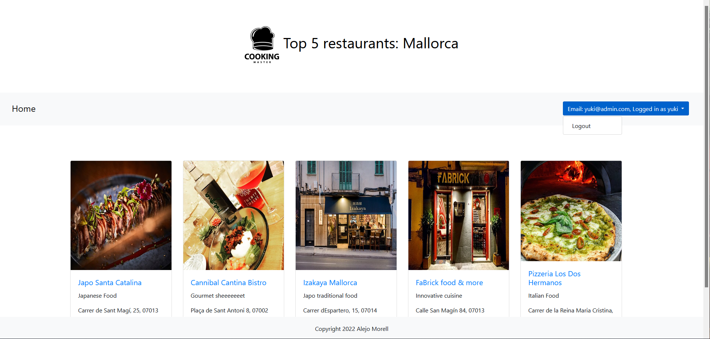

# Restaurants_MorelAlejo

This will be a restaurant rating web made by Alejo Morell for IAW subject.

## Stages

1. Define restaurant class and create web template as well as the functions needed to compile the web.
2. Connect the web to a database
3. Set Login and user interactions

## Requirements

+ Docker installed and basic knowledge

## Installation

Simply clone the repository and then execute:

```bash
$ docker-compose up -d
```

Access to the web using the specified port on the `docker-compose.yml` file, `8085` by default.



## Technologies

+ Docker
+ PHP
+ MariaDB
+ HTML + CSS
+ Bootstrap
